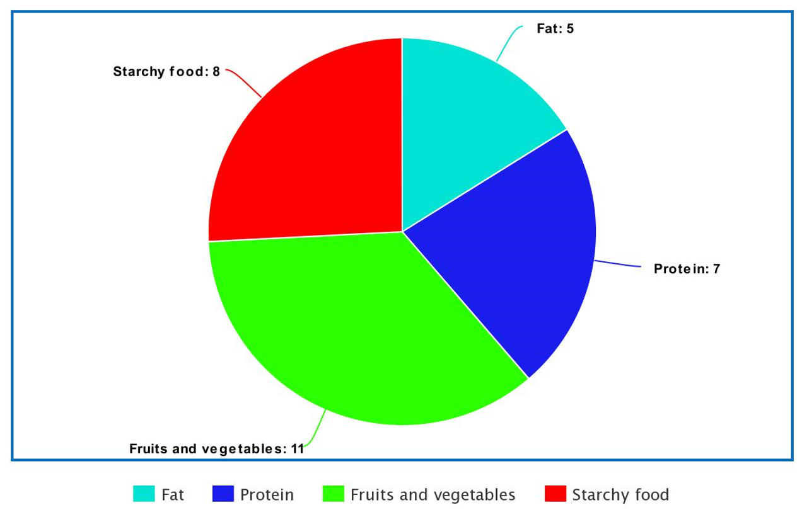
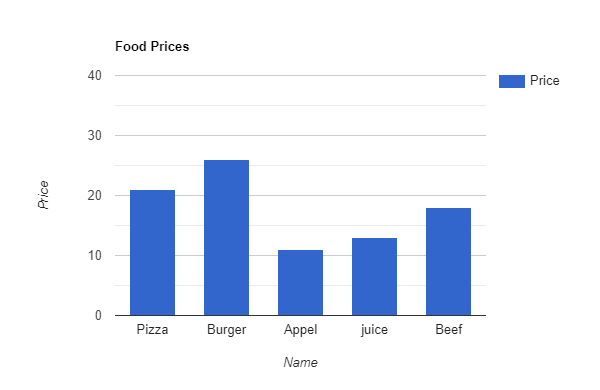

# Restaurant Project

## Task 13

### **Overview**

In this task you will continue building on what you achieved in the previous lab, you will use `Chart.js` CDN library to display the data from the table in two different shapes.

## **Requirements**

### **_Set up your Github Repository_**

- Today you will continue working on your `Restaurant` repo.
- Update your **README** file to add your changes for today.
- Checkout a new branch called `chartJS` for today's lab.
- Install chart.js library `npm install chart.js`
- Open it in VS code.

### Inside **Statistics page** :

Below the food types table, create two forms of charts:

- `Pie` chart :

  After calculating the number of instances of each food type, create a chart displaying the type and number, you should have something similar to this:

  

- `Bar` chart :

  Now for the bar chart you are supposed to display the prices of each food and its name to a graph that looks similar to this:

  

Take a look at [chart.js](https://www.chartjs.org/docs/latest/) documentation and find out how to build chart graphs using this library.

### **Styling**

Add more styling to your website, make it look professional, just ready to lunch.

## Submission Instructions:

- When your work is complete and ready for submission, push to the `chartJS` branch.
- Create a pull request.
- Deploy to the Github pages.
- Submit the pull request and deployed version (Live URL) links.
- Merge `chartJS` with the main branch.
- Answer these two questions in the submission comments:

  - What observations or questions do you have about what you’ve learned so far?
  - How long did it take you to complete this assignment? And, before you started, how long did you think it would take you to complete this assignment?
