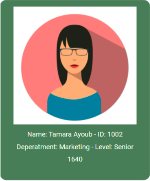

# HR-management-system

## Task 09

### **Overview**

You will continue building on what you achieved in the last task.

## **Requirements**

### **Set up your Github Repository***

- Today you will continue working on your `HR-management-system` repo.
- Update your **README** file to add your changes for today.
- Checkout a new branch called `constructor` for today's task.
- Open it in VS code.

### **Home page**

1. Replace all of your object literals for the `HR-management-system` with a single constructor function that, when called with the ‘new’ keyword, it creates a new instance.

2. You will refactor the  render function to be a prototype function to render each employee information in a separate card in the home page as shown below. Note that you will use images for the employees in the assets directory.

### **Style**

1. Add some style for the header and the footer
2. Use flex to organize the content of the main content.
3. Add backgrounds, font colors, google fonts and any additional style.
4. Use a suitable color palette for your website. You can use [ColorHunt](https://colorhunt.co) .

**Note:**
Be creative and make your page professional.

### **Stretch goal**

Separate the employees cards by their department where you will have a separate section for each department.

## Submission Instructions:
- When your work is complete and ready for submission, push to the `events` branch.
- Create a pull request.
- Deploy to the Github pages.
- Submit the pull request and deployed version (Live URL) links.
- Merge `constructor` with the main branch.
- What observations or questions do you have about what you’ve learned so far?
- How long did it take you to complete this assignment? And, before you started, how long did you think it would take you to complete this assignment?